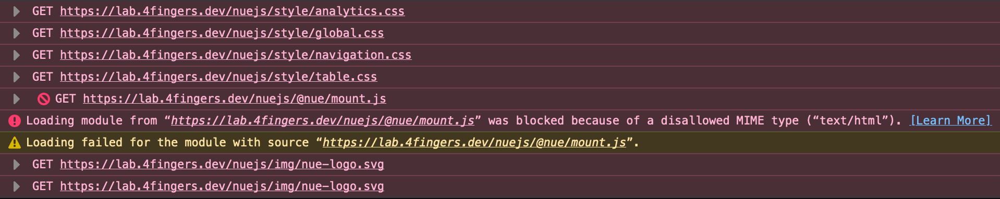

# Nuejs SPA subpath deploy

I create this repo to reproduce Nue.js SPA deploy problem at sub path of domain.



## Environment

- Bun 1.1.6
- Nue 0.5.3

## What I modified

`app.nue`

Old:
`import { router } from '/@nue/app-router.js'`

New:
`import { router } from '/nuejs/@nue/app-router.js'`

Old:

```
<nav>
  <a href="/">Users</a>
  <a href="/feedback">Feedback</a>
  <a href="/analytics">Analytics</a>
</nav>
```

New:

```
<nav>
  <a href="/nuejs">Users</a>
  <a href="/nuejs/feedback">Feedback</a>
  <a href="/nuejs/analytics">Analytics</a>
</nav>
```

`site.yaml`

- Add new config: `base: /nuejs`
- Add subpath to favicon URL

## Deployment

1. Build production files

```
nue build --production
```

2. Run `nginx` container

```
docker compose up --build -d
```
